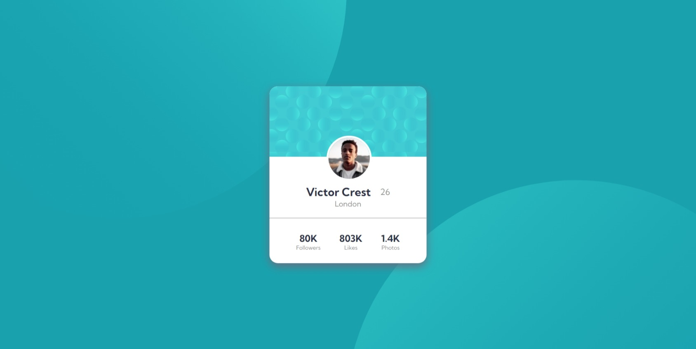
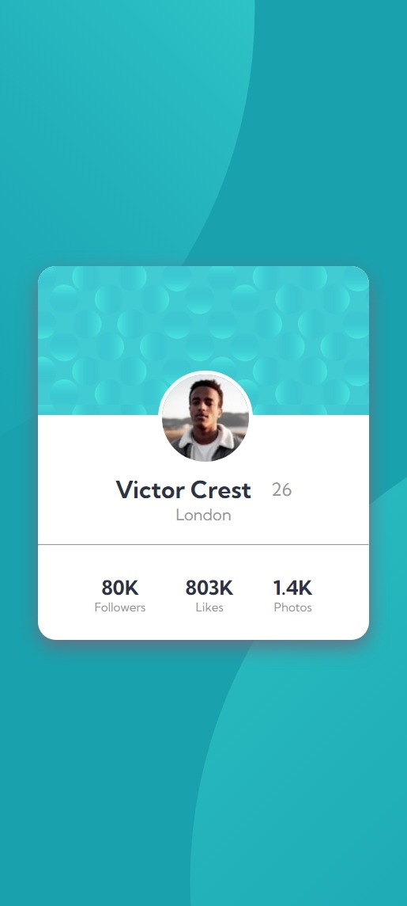

# Frontend Mentor - Profile card component solution

This is a solution to the [Profile card component challenge on Frontend Mentor](https://www.frontendmentor.io/challenges/profile-card-component-cfArpWshJ). Frontend Mentor challenges help you improve your coding skills by building realistic projects. 

## Table of contents

- [Overview](#overview)
  - [The challenge](#the-challenge)
  - [Screenshots](#screenshots)
  - [Links](#links)
- [My process](#my-process)
  - [Built with](#built-with)
  - [What I learned](#what-i-learned)
  - [Useful resources](#useful-resources)
- [Author](#author)
- [Acknowledgments](#acknowledgments)

## Overview

### The challenge

- Build out the project to the designs provided

### Screenshots

### Links

- Solution URL: [Add solution URL here](https://your-solution-url.com)
- Live Site URL: [Add live site URL here](https://your-live-site-url.com)

## My process

### Built with

- HTML5 markup
- Flexbox
- CSS

### What I learned

I learned about CSS background properties as I had to implement them in this project. On the surface, it looked like an easy layout to build. However, the challenging parts for me were the background SVGs and the profile picture. This was challenging because I had only worked with normal backgrounds before. Here, I had to position the background SVGs in a specific manner. Additionally, making the profile picture appear half inside and half outside the banner was also tricky to do.

### Useful resources

- [Example resource 1](https://developer.mozilla.org/en-US/) - This is a really good resource for learning web dev stuff.

## Author

- Website - [DDeepanshu99](https://github.com/DDeepanshu99)
- Frontend Mentor - [@DDeepanshu99](https://www.frontendmentor.io/profile/DDeepanshu99)

## Acknowledgments

I would like to give thanks to Raghav Gulati who helped me in this project. I was struggling with the background svgs and he was quite helpful. Checkout his profile [Rgulati4657](https://www.frontendmentor.io/profile/Rgulati4657)

